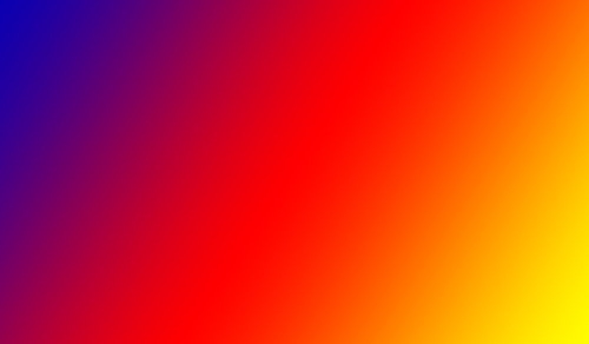
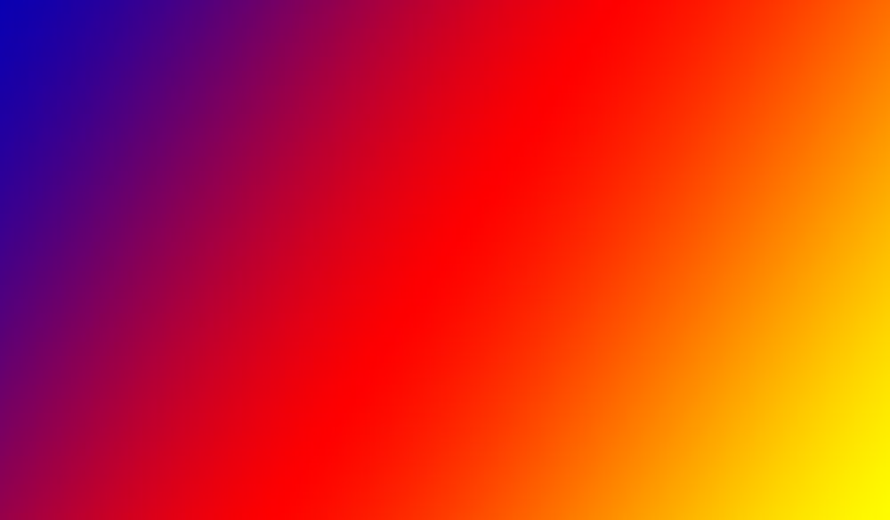
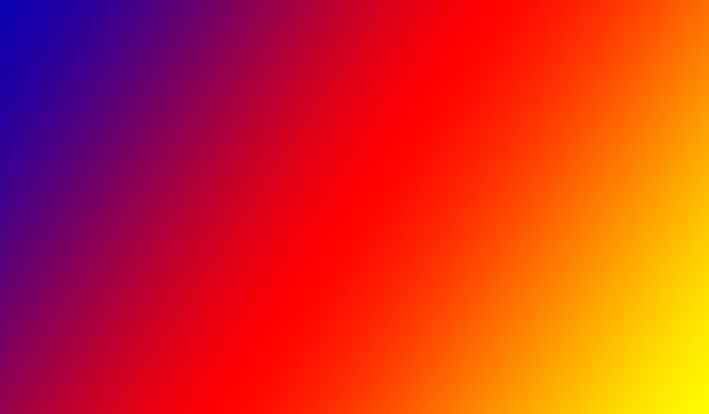
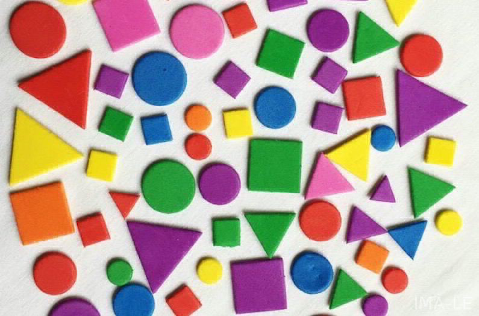
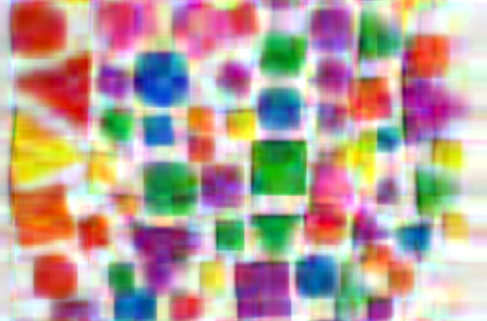
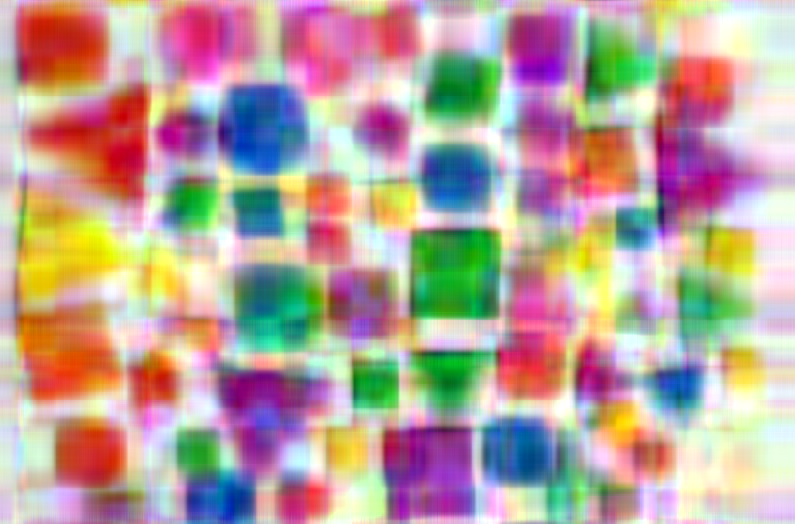
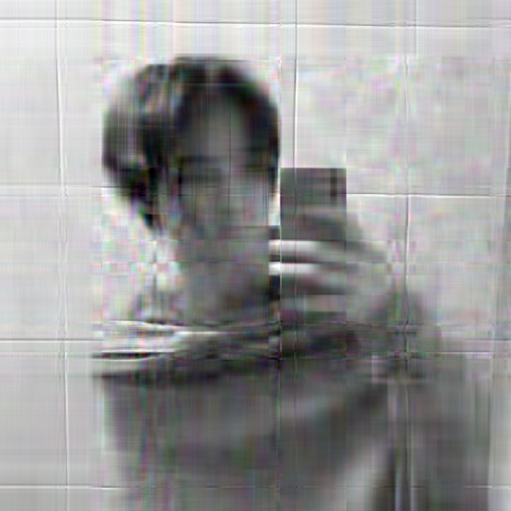
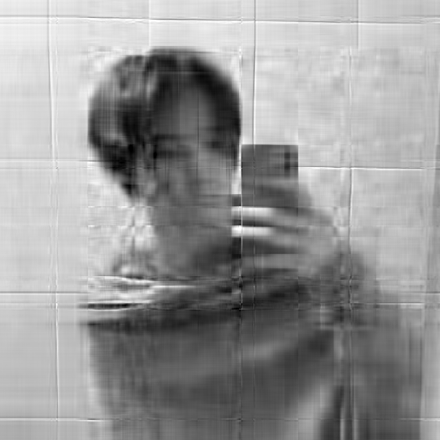
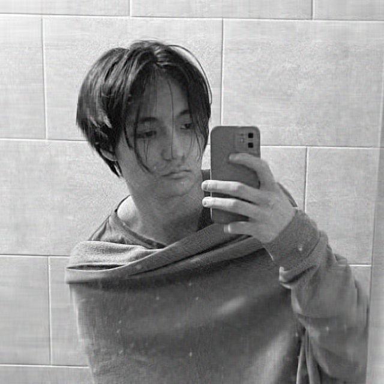

# Сжатие bmp24 изображений с использованием SVD

## Описание
В работе представлено 3 различных алгоритма сингулярного разложения:

- Numpy SVD
- [SVD Power method](http://www.cs.yale.edu/homes/el327/datamining2013aFiles/07_singular_value_decomposition.pdf)
- [Block SVD Power Method](https://www.degruyter.com/document/doi/10.1515/jisys-2018-0034/html#j_jisys-2018-0034_fig_004)

### Описание промежуточного представления

После сжатия картинки сохраняются в специальных файлах промежуточного представления с расширением `.svd-bmp`.

Файл промежуточного представления имеет структуру:
- заголовок
- контект

#### Описание заголовка промежуточного файла

Общий размер заголовка составляет 19 байт.

Более подробное описание заголовка промежуточного файла представлено в таблице:

| Наименование | Размер (байты) | Описание                     |
|--------------|----------------|------------------------------|
| "SVD-BMP"    | 7              | Магическое число             |
| height       | 4              | Высота картинки              |
| width        | 4              | Ширина картинки              |
| k            | 4              | Количество сингулярных чисел |

#### Описание контента промежуточного файла

Контент промежуточного файла представляет из себя последовательно записанные для трех каналов (в порядке RGB) результаты сингулярного разложения.

То есть для каждого из каналов в виде непрерывного массива байтов записано `U`, `S`, `V^T`.

Таким образом, память, занимаемая в промежуточном файле каждым из каналов, равна: $CS = 4 * k * (height + width + 1)$, а общий размер контента файла имеет размер $3 * CS$

## Эксперимент

Если в описании эксперимента не указано значение параметра сжатия N, то N = 5.

### Градиент
Для начала попробуем сжать картинку "градиент".
Посмотрим на то, как алгоритмы справляются с плавно переходящими цветами.

| Оригинал                                        | Numpy                                              | Power                                         | Block power                                         |
|-------------------------------------------------|----------------------------------------------------|-----------------------------------------------|-----------------------------------------------------|
|  |        |   |   |

В результате получаем 4 одинаковые (или почти одинаковые) картинки. С плавно переходящими цветами алгоритмы справились отлично.

### Геометрические фигуры

Теперь попробуем сжать картинку с геометрическими фигурами (на не есть и резкие цветовые переходы).

| Оригинал                                      | Numpy                                             | Power                                          | Block power                                          |
|-----------------------------------------------|---------------------------------------------------|------------------------------------------------|------------------------------------------------------|
|  |         |      |      |

С более резкими переходами в цветах все три алгоритма справляются уже не так хорошо. 

Важно заметить, что треугольники и квадраты имеют более четкое очертание, чем круги. (Круги стали похожи на квадраты :) )

Также важно заметить, что алгоритмам Numpy и Block SVD Power лучше удалось сохранить четкость фигур.

### Черно-белая фотография

Теперь попробуем сжать черно-белую фотографию Тимы.

| Оригинал                                    | Numpy                                       | Power                                       | Block power                                       |
|---------------------------------------------|---------------------------------------------|---------------------------------------------|---------------------------------------------------|
|  |  |  |  |

Алгоритмы довольно хорошо справились сохранить красивую плитку на фоне, однако сохранить в хорошем качестве Тиму им не удалось (опять-таки из-за резких изменений цвета).

Тут также стоит заметить, что алгоритмы Numpy и Block SVD Power справились лучше (можно посмотреть, например, на глаза)

Интересный факт

Если попробовать сжать фотографию Тимы в N = 1 раз, то получим следующий результат:

| Оригинал                                    | Numpy                                       | Power                                       | Block power                                       |
|---------------------------------------------|---------------------------------------------|---------------------------------------------|---------------------------------------------------|
|  |  |  |  |

При детальном рассмотрении фотографий мне удалось выяснить, что алгоритм SVD Power оставляет меньше артефактов, чем два остальных алгоритма.
Это интересно, поскольку в двух предыдущий показательных экспериментах  SVD Power показывал худший результат.

## Вывод

- Все три алгоритма показывают довольно неплохой результат даже при сильном сжатии картинки. Однако Numpy и Block SVD Power все же справляются лучше.
- У данных SVD алгоритмов есть проблемы со сжатием кругов и, вероятно, со всеми фигурами, имющими большое кол-во углов.
- Алгоритмы отлично справляются с картинками, на которых смена цветов происходит плавно.