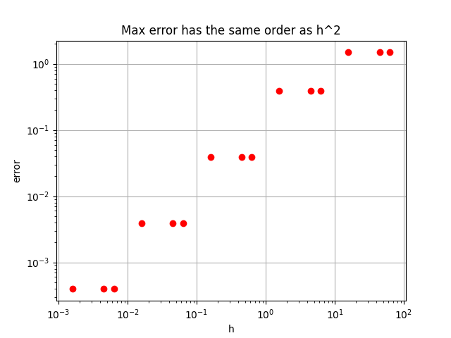

## FEM

При выполнении задания активно использовалась [легендарная книга](http://www.ict.nsc.ru/matmod/files/textbooks/KhakimzyanovCherny-2.pdf). 

### Используемое оборудование/инструменты

* Процессор — Apple M1
* Оперативная память — 16.0 GB
* Операционная система — MacOS 14.4.1
* Python 3.9

### Рассматриваемое уравнение

Будем решать уравнение:  $y'' - \lambda y = - 2 \lambda \sin (\sqrt \lambda x)$ с граничными условиями Дирихле $y(0) = 0$, $y(4 * \pi / \sqrt{λ}) = 0$.
Данное уравнение имеет решение вида: $y = sin(\sqrt{λ}*x)$

### Теоретическая оценка о втором порядке сходимости

Теоретическая оценка о втором порядке сходимости приведена в "легендарной книге".
Она подтверждается полученными результатами.
### Результаты

Замеры проводились на комбинациях lambdas = [1 / 16, 1 / 128, 1 / 256] и grid_sizes = [10, 100, 1000, 10000, 100000]

